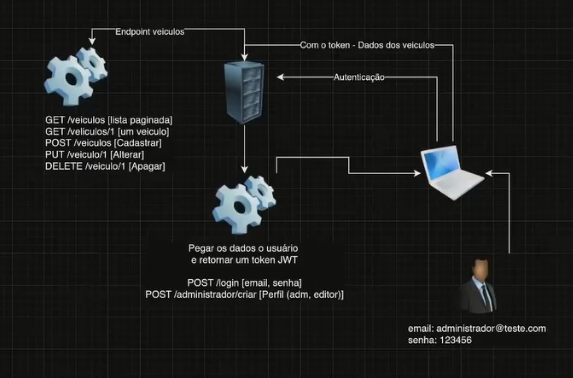

# minimal-api
Desafio de Projeto - Trabalhando com ASP.NET Minimals  APIs

usee o seguinte comando para informar os dados do banco de dados

dotnet user-secrets --id minimal-api-123456 set "ConnectionStrings:MySql" "Server=localhost;Database=minimal_api;Uid=root;Pwd=_SUA_SENHA_;"

substituindo _SUA_SENHA_ pela senha do banco MySql

  <PropertyGroup>
    <TargetFramework>net9.0</TargetFramework>
    <UserSecretsId>minimal-api-123456</UserSecretsId> --- deve possuir essa linha ---
    <Nullable>enable</Nullable>
    <ImplicitUsings>enable</ImplicitUsings>
    <RootNamespace>minimal_api</RootNamespace>
  </PropertyGroup>

  
